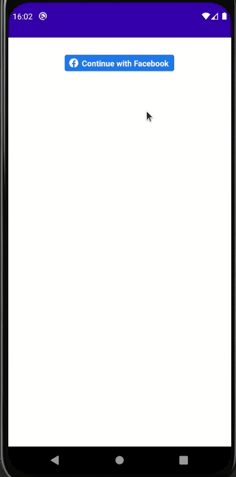
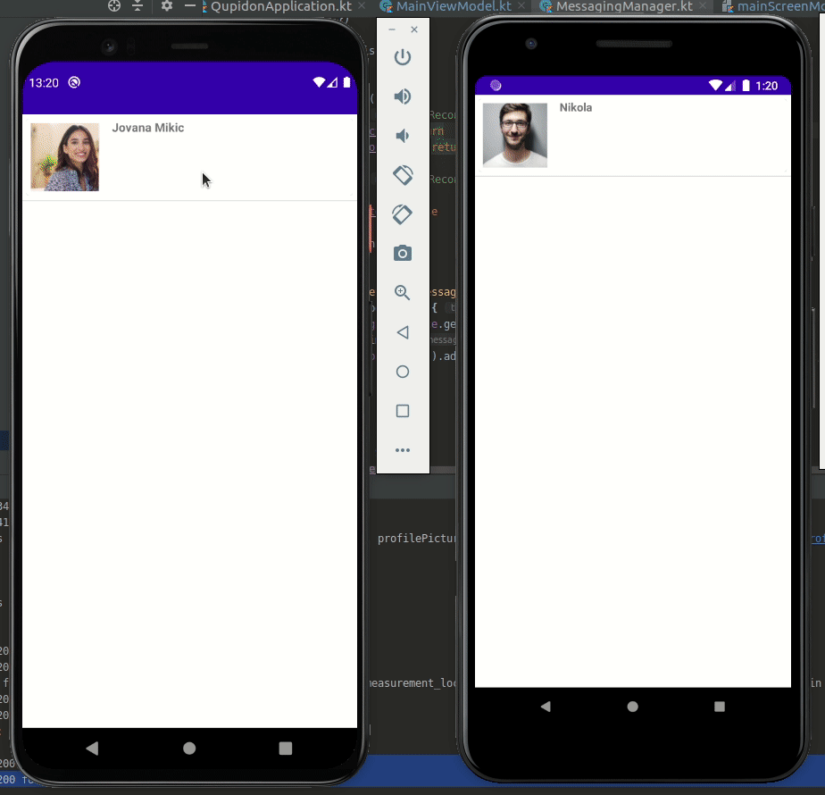
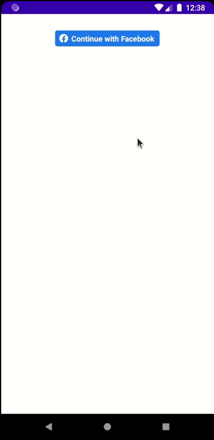
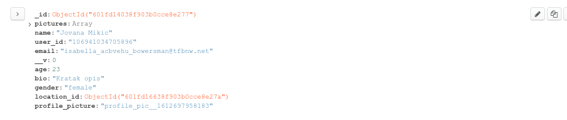
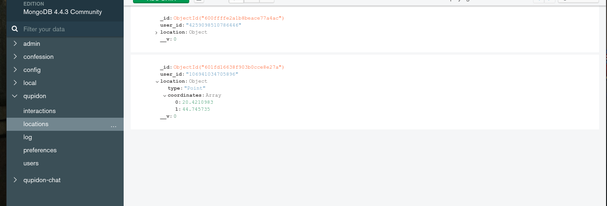

# Qupidon-App
Dating application, register with Facebook, create new User, save your data to a custom backend, and your images to AWS S3 database. Match with potential partners and message them

# Potentional matches

Potentional matches, based on location (geoqueries), preferences

### Messaging

Websocket realtime messaging or Firebase Cloud Messaging notifications when the user is offline

### New user and facebook registering

Register via Facebook login from Facebook SDK, create your profile and preferences. Both are saved to a MongoDB, while the profile picture is saved to AWS S3.

#

#

